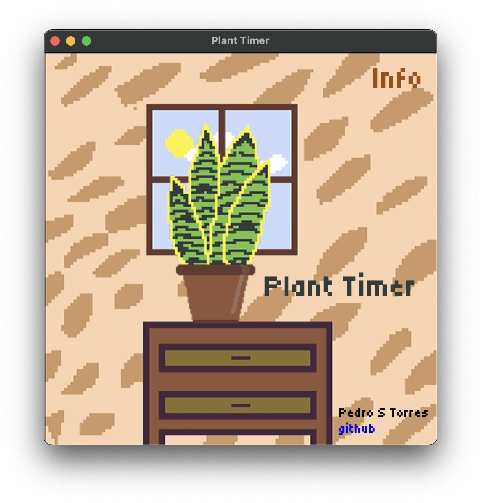
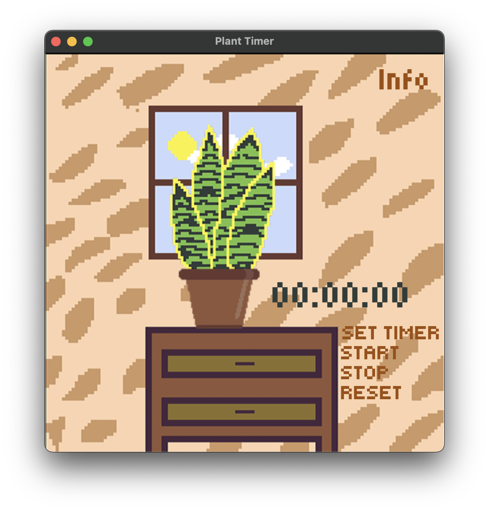
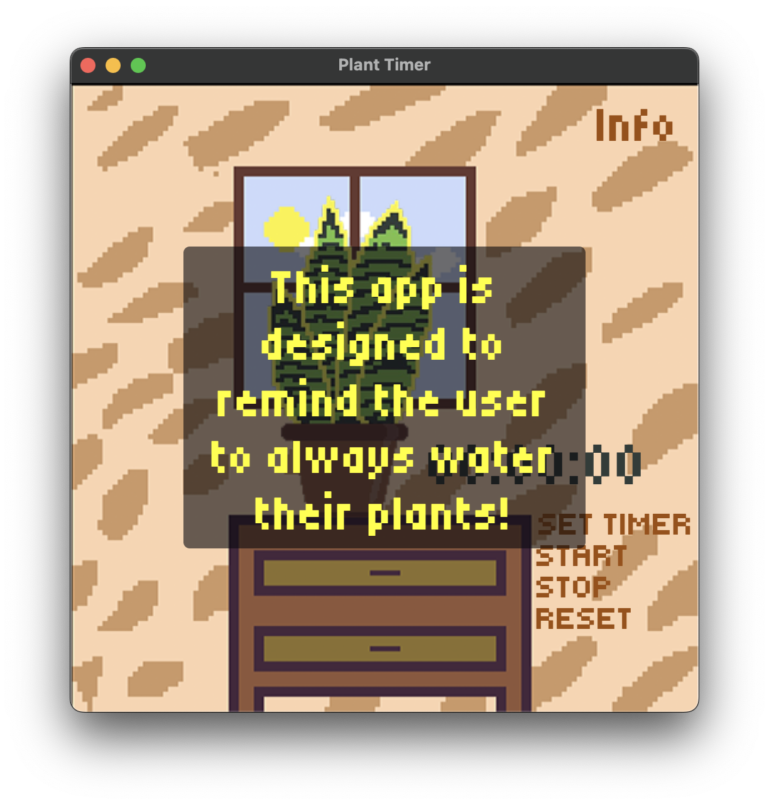
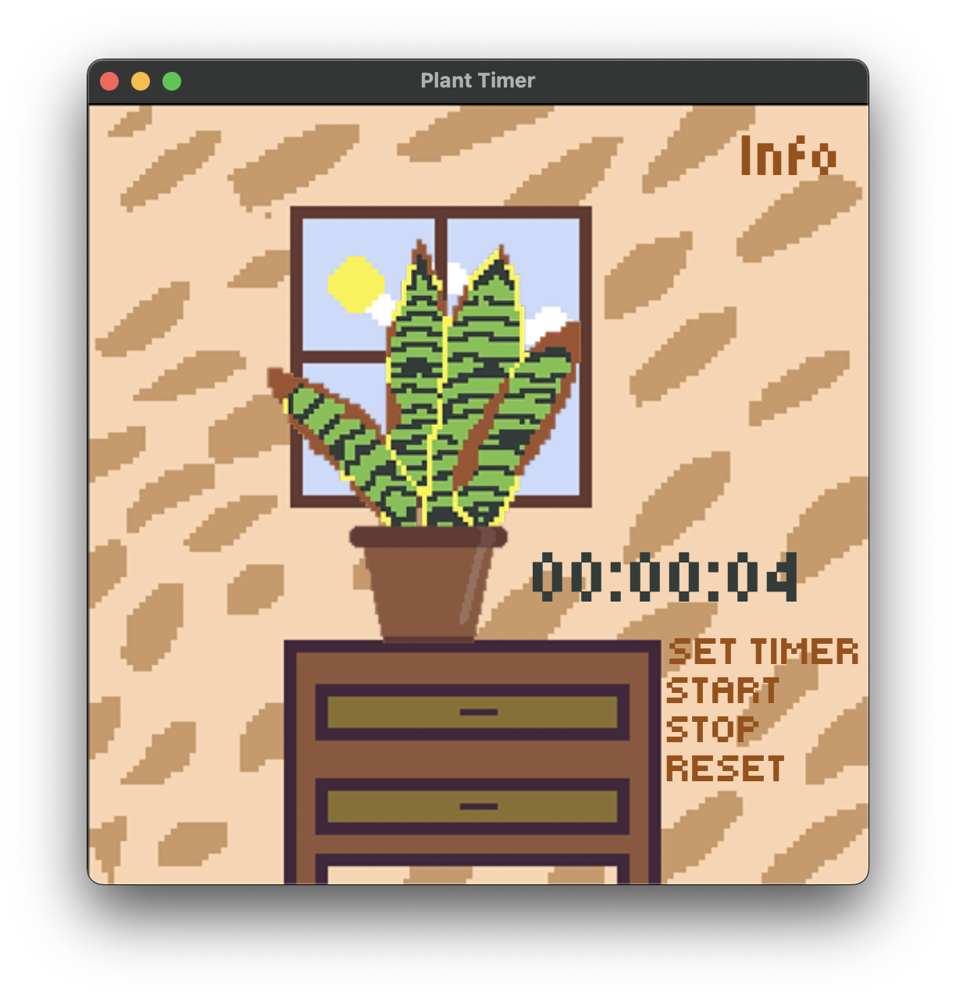
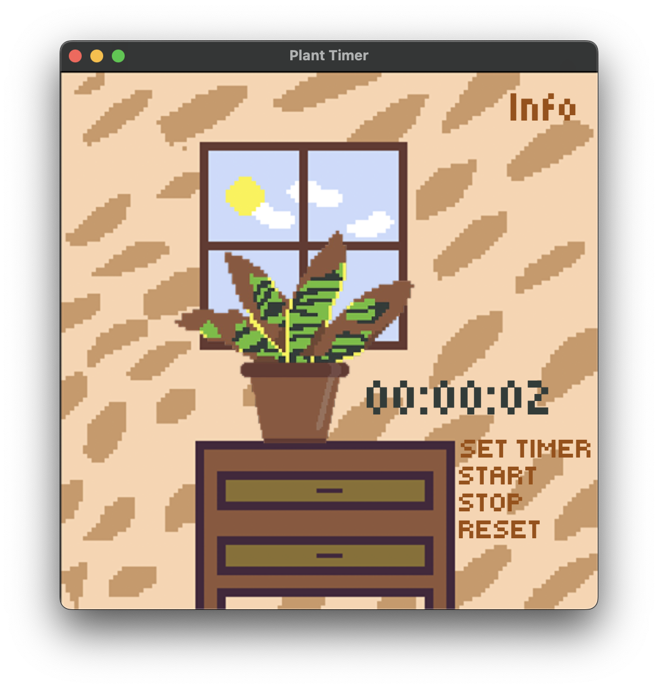
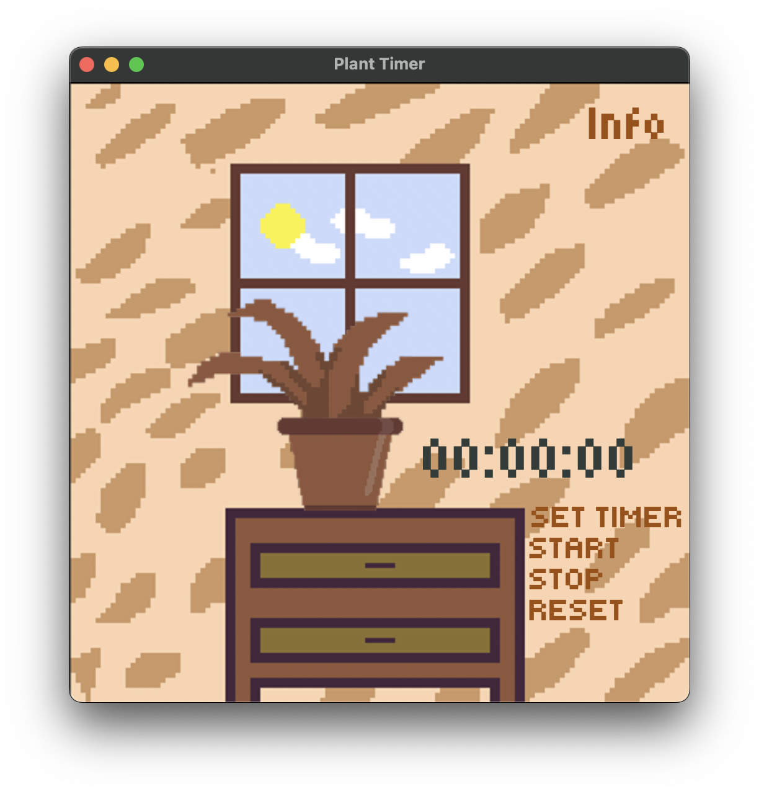

# 🌿 Plant Timer

O **Plant Timer** é um aplicativo de desktop multiplataforma feito com Electron que tem como objetivo ajudar você a manter suas plantas bem cuidadas, lembrando os momentos exatos para regá-las. Ele combina funcionalidades práticas com uma interface amigável e elementos visuais animados.

---

## 📦 Sobre o projeto

Este projeto foi desenvolvido como prática de front-end, com foco na manipulação do DOM, controle de tempo com `setInterval` e interação básica com o usuário por meio da interface.

---

## ✨ Funcionalidades

- Timer com contagem regressiva
- Estágios de tempo com mudança de interface
- Botões para iniciar, pausar e resetar o tempo
- Interface simples e direta

---

## 📸 Screenshots

1. Tela inicial:



2. Tela principal:



3. Informações sobre o app:



4. Mudanças de background conforme o tempo avança:









---

## 🎮 Como usar

1. Faça o download ou clone o repositório:
```bash
git clone https://github.com/seu-usuario/plant-timer.git
